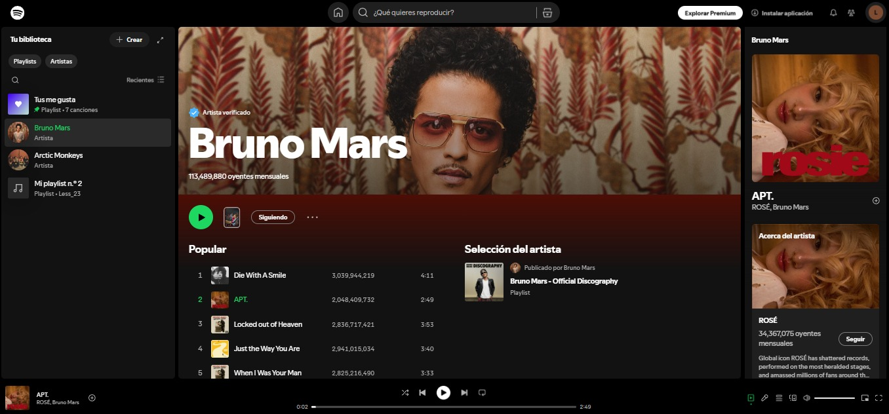
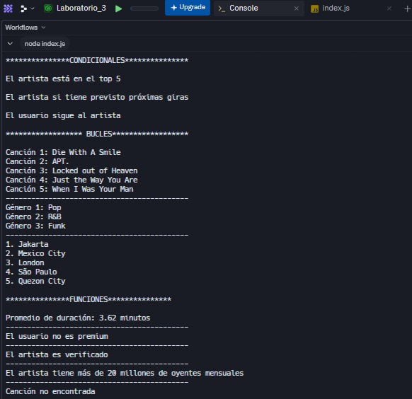

<h1 align="center">🎶 SPOTIFY 🎶</h1>

Para la realizacion de la actividad se tomo como ejemplo la plataforma Spotify. Los variables y funciones se inspiraron en los detalles y características del cantante Bruno Mars, sus canciones y el perfil del usuario.

## 🛠️ Creado por

Este proyecto fue completado por las siguientes integrantes:

- Nayely Ayol
- Alessia Pérez
- Emily Galeas

## 🗂️ Fuente usada para la realización del Proyecto

  |

## 🧾 Resultados del Proyecto

  |
